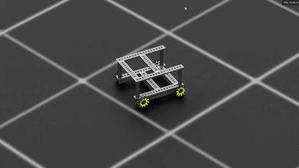
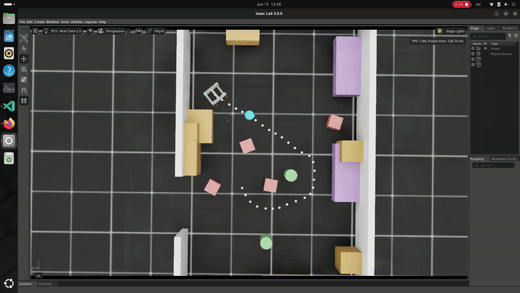

# Sim2RealLab — Strafer robot

Sim-to-real research platform for a GoBilda Strafer mecanum-drive robot: Isaac Lab training, Jetson ROS 2 runtime, off-robot VLM + LLM services, and a synthetic-data pipeline that turns procedurally-generated indoor scenes into fine-tune datasets.

Sim2RealLab is a multi-package monorepo. The same robot runs in
simulation and on real hardware because the two sides share one set of
physical constants, one mecanum kinematics implementation, and one
policy I/O contract (in `strafer_shared`). Natural-language commands
enter through a Jetson-local ROS action; an LLM planner on the DGX
Spark turns them into bounded skill sequences; the Jetson executor runs
those skills while a VLM grounds semantic targets and Nav2 handles
local motion. A sim-in-the-loop harness can replace the real robot with
Isaac Sim without changing any Jetson-side code.

<!-- TODO: Replace with the end-to-end demo (sim + real) once recorded.
     GitHub strips <video> in READMEs, so commit an animated GIF preview
     (docs/artifacts/strafer_end_to_end_demo.gif) — make it from the mp4 with
     ffmpeg palettegen/paletteuse — then uncomment this block and remove this TODO.

     <p align="center">
       
       <br/>
       <em>End-to-end: "go to the X" running in sim and on real hardware.</em>
     </p>
-->

<p align="center">
  
  
</p>

## What ships today

- **Autonomy pipeline operational end-to-end on real hardware.** `"go to the tennis ball"` has been tested from CLI through LLM planning, VLM grounding, projection, Nav2 navigation, and semantic-map arrival verification.
- **Nine mission intent types** compiled into bounded plans: `go_to_target`, `wait_by_target`, `go_to_targets`, `patrol`, `rotate`, `describe`, `query`, `cancel`, `status`.
- **Fourteen executor skills** including the composite `scan_for_target` (rotate + ground loop), `explore_until_visible` (frontier-driven cross-room target discovery), `verify_arrival` (CLIP top-k ranking), `describe_scene`, and `query_environment`.
- **Agentic `POST /plan_with_grounding`** endpoint — planner pre-grounds targets via a co-located VLM call, saving one LAN image round-trip per mission.
- **Full Jetson ROS stack** — RoboClaw driver, RealSense D555 with timestamp-fixed `*_sync` topics, RTAB-Map SLAM, Nav2 MPPI holonomic controller, goal projection service.
- **9 registered Isaac Lab environments** — three RL families (depth-real, depth-robust, no-cam), each with a `-Play` evaluation variant, plus three capture variants (teleop, bridge, coverage). Composed over sensor stack × scene source × realism; see [`strafer_lab` README](source/strafer_lab/README.md#contracts).
- **Synthetic-data pipeline** — Infinigen procedural scene generation, per-scene metadata embedded in the USD's `customData` with `UsdSemantics` detection labels, 4-stage description pipeline (programmatic spatial → Qwen2.5-VL-7B → ground-truth filter → human spot-check), OpenCLIP contrastive fine-tune with ONNX export, comprehensive VLM LoRA SFT data prep.
- **Isaac Sim ROS 2 bridge + sim-in-the-loop harness** — drive the Jetson autonomy stack against simulated sensors on the DGX without changing any Jetson code; capture reachability-labelled datasets from Jetson-driven missions.
- **Databricks Model Serving deployment path** — alternative to LAN HTTP for the planner + VLM services; executor swaps transport via env vars.

<p align="center">
  
  <br/>
  <em>Synthetic-data ground truth: the sim-in-the-loop harness boxing Infinigen furniture (chair, sofa, table, tv, microwave, …) via Replicator + USD semantics on a 360° camera spin. Structural surfaces (wall / floor / ceiling) are deliberately excluded so furniture isn't evicted from the truncated detections column.</em>
</p>

<p align="center">
  
  &nbsp;
  
  <br/>
  <em>Left: Isaac Lab test drive on the Strafer USD. Right: a trained <code>NOCAM_SUBGOAL</code> RL policy tracking a sim-planned path, proprioception only (no camera). Looping previews; full clips in <code>docs/artifacts/</code>.</em>
</p>

<p align="center">
  
  <br/>
  <em>A procedurally generated Infinigen apartment — one of the synthetic scenes the pipeline turns into labeled training data.</em>
</p>

## Role in the system

The repository is five packages plus shared interfaces, spread across two hosts:

| Package | Host | Responsibility | Deep dive |
|---|---|---|---|
| `strafer_lab` | DGX Spark (preferred) or Windows GPU | Isaac Lab environments, PPO training, Infinigen scene generation, synthetic-data pipeline, Isaac Sim ROS 2 bridge, sim-in-the-loop harness | [README](source/strafer_lab/README.md) · [Install](source/strafer_lab/README.md#install) · [Run](source/strafer_lab/README.md#run) |
| `strafer_shared` | both | Physical constants, mecanum kinematics, policy I/O contract (the sim-to-real boundary) | — (library; no install of its own) |
| `strafer_ros` | Jetson Orin Nano | ROS 2 driver, perception, SLAM, Nav2, URDF, bringup launches, shared ROS interface types | [README](source/strafer_ros/README.md) · [Install](source/strafer_ros/README.md#install) · [Run](source/strafer_ros/README.md#run) |
| `strafer_autonomy` | Jetson (executor + CLI) + DGX (planner service) | Mission planning, mission execution, shared schemas, service clients, semantic spatial map | [README](source/strafer_autonomy/README.md) · [Install](source/strafer_autonomy/README.md#install) · [Run](source/strafer_autonomy/README.md#run) |
| `strafer_vlm` | DGX Spark | Qwen2.5-VL grounding / description / multi-object detection service + LoRA fine-tuning tooling | [README](source/strafer_vlm/README.md) · [Install](source/strafer_vlm/README.md#install) · [Run](source/strafer_vlm/README.md#run) |

Each package README is the source of truth for that package's features,
contracts, setup, commands, design, and testing. This top-level document
covers cross-package framing, the host architecture, and the bootstrap
paths for each host.

## Architecture

```text
Jetson Orin Nano (robot)                   DGX Spark (workstation)
──────────────────────────                 ──────────────────────────
strafer_ros                                strafer_vlm (:8100)
  ├─ strafer_driver    (RoboClaws)          ├─ POST /ground
  ├─ strafer_perception                     ├─ POST /describe
  │   └─ goal_projection_node               └─ POST /detect_objects
  ├─ strafer_slam      (RTAB-Map)
  ├─ strafer_navigation (Nav2 MPPI)        strafer_autonomy.planner (:8200)
  ├─ strafer_description (URDF + TF)        ├─ POST /plan
  └─ strafer_msgs                           └─ POST /plan_with_grounding
strafer_autonomy.executor                  strafer_lab
  ├─ AutonomyCommandServer                   ├─ Isaac Lab envs (9 registered)
  │   (ExecuteMission.action)                ├─ Synthetic-data pipeline
  ├─ MissionRunner                           ├─ Isaac Sim ROS 2 bridge
  │   (13 skills, verify_arrival)            └─ Sim-in-the-loop harness
  ├─ HttpPlannerClient → DGX:8200
  ├─ HttpGroundingClient → DGX:8100
  └─ SemanticMapManager (CLIP + ChromaDB)

            ←───  LAN HTTP (planner + VLM calls)  ───→
            ←───  ROS 2 DDS (sim-in-the-loop topics) ───→
```

Cross-host transport uses `rmw_cyclonedds_cpp` with `ROS_DOMAIN_ID=42`
over LAN. HTTP goes over the same LAN (DGX `192.168.50.196`, Jetson
`192.168.50.24` in the reference setup).

<p align="center">
  
  
  <br/>
  <em>VLM grounding in practice: "green yucca plant end of hall" — original scene (left) and the Postman <code>POST /ground</code> response with bbox overlay (right)</em>
</p>

## Hardware

| Component | Model | Purpose |
|---|---|---|
| Workstation | NVIDIA DGX Spark (Grace ARM64 + Blackwell GB10, 128 GB unified memory) | Isaac Lab / Sim, VLM + planner services, synthetic-data pipeline |
| Robot compute | Jetson Orin Nano (JetPack 6.2, L4T R36.5.0) | ROS 2 runtime, executor, Nav2, SLAM |
| Camera | Intel RealSense D555 | RGB 640×360 + aligned depth + BMI055 IMU |
| Motors | 4× GoBilda 5203 Yellow Jacket (19.2:1, 537.7 PPR) | Mecanum drive |
| Motor controllers | 2× RoboClaw ST 2x45A | USB serial, dual-controller addressing (0x80 / 0x81) |
| Chassis | GoBilda Strafer v4 | 4-wheel mecanum platform |

Windows GPU workstations can stand in for the DGX for Isaac Lab + VLM fine-tuning, though Isaac Sim on aarch64 only officially supports DGX Spark.

## Repository structure

```text
Sim2RealLab/
├── Readme.md                         # this file
├── .env.example / env_setup.sh       # per-machine configuration loader
├── Makefile                          # colcon build, ROS launches, DGX service targets
├── source/
│   ├── strafer_lab/                  # Isaac Lab extension + synthetic-data pipeline
│   ├── strafer_shared/               # Physical constants, kinematics, policy I/O
│   ├── strafer_ros/                  # ROS 2 packages (driver / perception / SLAM / nav / msgs / bringup)
│   ├── strafer_autonomy/             # Executor + planner service + clients + schemas + semantic map
│   ├── strafer_vlm/                  # VLM service + inference runtime + training tooling
│   └── SImToRealLab.postman_collection.json
└── docs/
    ├── STRAFER_AUTONOMY_NEXT.md         # current-round design master (ground truth for intent)
    ├── SYSTEM_FLOW_DIAGRAMS.md          # cross-package runtime flow reference
    ├── SIM_TO_REAL_TUNING_GUIDE.md      # deep-dive actuator + sensor alignment
    ├── WIRING_GUIDE.md                  # motor + encoder + RoboClaw + Jetson wiring
    ├── D555_IMU_KERNEL_FIX.md           # Tegra kernel module build for D555 IMU
    ├── INTEGRATION_SIM_IN_THE_LOOP.md    # cross-host bridge runbook (DGX + Jetson)
    ├── example_commands_cheatsheet.md   # one-liners operators copy-paste during ops
    ├── tasks/                           # one-shot Jira-style task briefs for follow-on work
    └── artifacts/, reference/           # images, videos, product inserts
```

## Contracts

Every stable boundary in the system is documented in exactly one place:

| Contract | Location |
|---|---|
| Physical constants (wheel radius, velocity limits, PID, depth clip) | [`source/strafer_shared/strafer_shared/constants.py`](source/strafer_shared/strafer_shared/constants.py) |
| Mecanum forward / inverse kinematics | [`source/strafer_shared/strafer_shared/mecanum_kinematics.py`](source/strafer_shared/strafer_shared/mecanum_kinematics.py) |
| Policy I/O contract (observation assembly + action interpretation) | [`source/strafer_shared/strafer_shared/policy_interface.py`](source/strafer_shared/strafer_shared/policy_interface.py) |
| Autonomy-layer schemas (`MissionPlan`, `GroundingRequest`, `Pose3D`, ...) | [`source/strafer_autonomy/strafer_autonomy/schemas/`](source/strafer_autonomy/strafer_autonomy/schemas/) |
| Planner HTTP API (`POST /plan`, `POST /plan_with_grounding`, `GET /health`) | [`source/strafer_autonomy/strafer_autonomy/planner/`](source/strafer_autonomy/strafer_autonomy/planner/) |
| VLM HTTP API (`POST /ground`, `/describe`, `/detect_objects`, `GET /health`) | [`source/strafer_vlm/strafer_vlm/service/app.py`](source/strafer_vlm/strafer_vlm/service/app.py) |
| ROS interfaces (`ExecuteMission.action`, `GetMissionStatus.srv`, `ProjectDetectionToGoalPose.srv`) | [`source/strafer_ros/strafer_msgs/`](source/strafer_ros/strafer_msgs/) |
| Streaming ROS topics (D555 sync topics, odom, TF, `/cmd_vel`) | `strafer_ros` — see [README](source/strafer_ros/README.md) |

If any of these contracts changes, the change must land in the listed
file — never duplicated in consumer code.

## Install

Every host uses the same two-file configuration mechanism:

```bash
cp .env.example .env
$EDITOR .env                 # fill in absolute paths for this machine
source env_setup.sh          # loads .env into the current shell
```

`env_setup.sh` is idempotent: it loads `.env`, prepends `LD_PRELOAD` on aarch64 hosts (so Isaac Sim's bundled torch finds libgomp), and creates the `<INFINIGEN_ROOT>/blender` symlink when both `INFINIGEN_ROOT` and `STRAFER_BLENDER_BIN` are set. `.env` is machine-specific and gitignored.

### DGX Spark (Grace + Blackwell, aarch64 Ubuntu)

Three conda / venv environments partition the stack:

| Env | Purpose | Key contents |
|---|---|---|
| `env_isaaclab3` | Isaac Sim + Isaac Lab + `strafer_lab` editable | Python 3.12, Isaac Sim 6 (bundled in Isaac Lab 3.0 develop), `pxr` via `.pth` |
| `env_infinigen` | Infinigen procedural scene generation | Python 3.11, source-built `bpy==4.2.0` wheel, Infinigen 1.19.x editable `--no-deps` |
| `.venv_vlm` | VLM + planner services, batch scripts, test suite | Python 3.12, PyTorch cu128, transformers, `strafer_vlm`, `strafer_autonomy` |

`.venv_vlm` bootstrap (all DGX service work starts here):

```bash
python3.12 -m venv .venv_vlm
source .venv_vlm/bin/activate
pip install --upgrade pip setuptools wheel
pip install torch torchvision --index-url https://download.pytorch.org/whl/cu128
pip install -e source/strafer_shared \
            -e "source/strafer_vlm[qwen,service,dev]" \
            -e "source/strafer_autonomy[planner]"
```

**Critical: NVRTC fix for Blackwell `sm_121`.** PyTorch cu128 bundles NVRTC from CUDA 12.8 which does not support Blackwell. Replace with the system CUDA 13.0 NVRTC:

```bash
NVRTC_DIR=".venv_vlm/lib/python3.12/site-packages/nvidia/cuda_nvrtc/lib"
mv "$NVRTC_DIR/libnvrtc.so.12" "$NVRTC_DIR/libnvrtc.so.12.bak"
mv "$NVRTC_DIR/libnvrtc-builtins.so.12.8" "$NVRTC_DIR/libnvrtc-builtins.so.12.8.bak"
ln -s /usr/local/cuda-13.0/lib64/libnvrtc.so.13.0.88 "$NVRTC_DIR/libnvrtc.so.12"
ln -s /usr/local/cuda-13.0/lib64/libnvrtc-builtins.so.13.0.88 "$NVRTC_DIR/libnvrtc-builtins.so.12.8"
make check-nvrtc
```

Must be redone if `nvidia-cuda-nvrtc` is upgraded or the venv is recreated. `make serve-vlm` and `make serve-planner` run this check first.

For the Isaac Lab 3.0 source build that backs `env_isaaclab3` and the aarch64 `bpy` wheel (`env_infinigen`), see the `README.md` inside the sibling `~/Workspace/blender-build/` directory and the upstream Isaac Lab install instructions.

### Windows workstation (fallback for Isaac Lab)

```powershell
& C:\Workspace\venv_isaac\Scripts\Activate.ps1
cd C:\Workspace
python -m pip install -e source/strafer_lab source/strafer_shared
python -m pip install -e "source/strafer_vlm[qwen,live,service]"
```

Windows does not run the planner / VLM services or Isaac Sim on ARM, but it works for PPO training and live VLM evaluation.

### Jetson Orin Nano

The Jetson checks the repo out at `~/workspaces/Sim2RealLab` — note the
lowercase, plural `workspaces`, distinct from the DGX's `~/Workspace`.

```bash
# ROS 2 packages via colcon
mkdir -p ~/strafer_ws/src
ln -s ~/workspaces/Sim2RealLab/source/strafer_ros/* ~/strafer_ws/src/
cd ~/strafer_ws
source /opt/ros/humble/setup.bash        # required before colcon build
colcon build --symlink-install
source install/setup.bash

# Autonomy Python package into the same environment. --no-build-isolation
# uses the system setuptools: PEP 660 editable installs need setuptools
# >= 64, but the build-isolation default pulls an older one on stock pip.
pip install --no-build-isolation \
            -e ~/workspaces/Sim2RealLab/source/strafer_shared \
            -e ~/workspaces/Sim2RealLab/source/strafer_autonomy

# udev rules for stable RoboClaw paths + D555 IMU permissions
sudo cp ~/workspaces/Sim2RealLab/source/strafer_ros/99-strafer.rules /etc/udev/rules.d/
sudo udevadm control --reload-rules && sudo udevadm trigger
```

From the repo root, `make build` runs the colcon build and `make udev` installs rules.

**D555 IMU on Tegra:** Jetson's Tegra kernel does not ship `CONFIG_HID_SENSOR_HUB`, so the D555 IMU is invisible until the five missing kernel modules are built out-of-tree. The full build recipe is in [`docs/D555_IMU_KERNEL_FIX.md`](docs/D555_IMU_KERNEL_FIX.md) — do it once per kernel upgrade.

## Run

### DGX: start the services

```bash
source .venv_vlm/bin/activate

# Terminal 1 — VLM grounding (model downloads ~7 GB on first run)
make serve-vlm

# Terminal 2 — LLM planner (model downloads ~8 GB on first run)
make serve-planner

# Terminal 3 — health checks
curl http://localhost:8100/health
curl http://localhost:8200/health
```

### Jetson: launch the robot stack

```bash
source ~/strafer_ws/install/setup.bash

# Navigation only (driver + perception + SLAM + Nav2)
make launch

# Full autonomy (navigation + goal projection + executor → DGX services)
VLM_URL=http://192.168.50.196:8100 PLANNER_URL=http://192.168.50.196:8200 \
    make launch-autonomy
```

### Jetson: submit missions

```bash
strafer-autonomy-cli submit "go to the tennis ball"        # follow feedback until done
strafer-autonomy-cli submit "wait by the couch" --detach   # return after accept
strafer-autonomy-cli status
strafer-autonomy-cli cancel
```

### DGX: Isaac Lab training

```bash
cd /home/zachoines/Workspace/Sim2RealLab
../IsaacLab/isaaclab.sh -p source/strafer_lab/scripts/train_strafer_navigation.py \
    --env Isaac-Strafer-Nav-RLNoCam-v0 --num_envs 512 --headless

tensorboard --logdir logs/rsl_rl/strafer_navigation
```

Full training / evaluation / synthetic-data / sim-in-the-loop recipes are in [`source/strafer_lab/README.md`](source/strafer_lab/README.md).

### Jetson: hardware validation

```bash
# Motor PID + step response
python3 source/strafer_ros/tune_pid.py --read
python3 source/strafer_ros/tune_pid.py --tune

# D555 camera + IMU standalone
python3 source/strafer_ros/test_d555_camera.py

# SLAM + motion verification
python3 source/strafer_ros/ros_test_slam.py --drive forward --duration 3
```

### Sim-in-the-loop (replace the real robot with Isaac Sim)

```bash
# DGX — manual / Nav2 mode (headless, daily-driver):
source env_setup.sh
make sim-bridge

# Jetson — full autonomy stack against the DGX bridge topics:
make launch-sim

# Operator workstation — Foxglove Studio over SSH for live
# camera / depth / TF / map debug visualization:
ssh -L 8765:localhost:8765 jetson-desktop
# then connect Foxglove Studio (https://app.foxglove.dev/ or the desktop
# app) to ws://localhost:8765 and import strafer_layout.json.

# DGX — reachability-labelled dataset capture (alternative to bridge mode).
# The scene's mission targets come from its USD customData (no sidecar):
isaaclab -p source/strafer_lab/scripts/run_sim_in_the_loop.py \
    --mode harness \
    --scene-name kitchen_01 \
    --output data/sim_in_the_loop/kitchen_01
```

End-to-end runbook + troubleshooting:
[`docs/INTEGRATION_SIM_IN_THE_LOOP.md`](docs/INTEGRATION_SIM_IN_THE_LOOP.md).
Operator one-liners (full sim-in-the-loop recipe with shell-by-shell
commands across DGX / Jetson / operator workstation):
[`docs/example_commands_cheatsheet.md`](docs/example_commands_cheatsheet.md).

## Design

**Monorepo with shared contracts.** Sim, ROS, autonomy, and VLM code stay in one repository so the core contracts (physical constants, kinematics, policy I/O, schemas, ROS interfaces) do not drift. Every stable boundary has exactly one file that owns it.

**`strafer_shared` is the sim-to-real boundary.** The real robot and Isaac Lab must agree on physical constants, mecanum kinematics, and policy observation / action contract. Every other package imports these values; none hardcode them.

**Execution stays on the robot.** Mission state, cancel, retry, timeout, and safety-critical behavior live on the Jetson. Planner and VLM services may move between workstation and Databricks cloud without changing the robot-side execution boundary. The robot is safe even if both services are unreachable — missions fail cleanly rather than stalling or misbehaving.

**Planner and executor stay separate.** The LLM is a text-to-plan service: it never emits raw skill sequences or ROS messages. A deterministic compiler is the sole source of skill structure. The executor owns every robot-side control decision. This split is what makes the mission space bounded and testable.

**The VLM stays narrow.** `strafer_vlm` does image-space grounding, description, and detection — nothing else. Depth projection, TF transforms, reachability, and motion execution remain robot-local. If any of those start accumulating inside `strafer_vlm`, the boundary has slipped.

**Every navigation ends with a `verify_arrival` step in the compiled plan.** The skill executes a CLIP top-k ranking against the semantic map, ranking-based (are 3 of 5 top neighbors within the goal radius?) rather than threshold-based, so it survives model changes and environment shifts. The semantic-map kwargs that back this skill are not wired into the production executor's `main.py` today — `verify_arrival` returns `semantic_map_disabled` until that wiring lands. See [`docs/MISSION_VALIDATION_ARCHITECTURE.md`](docs/MISSION_VALIDATION_ARCHITECTURE.md) for the audit and the staged plan.

**Sim-in-the-loop preserves topic names.** The Isaac Sim ROS 2 bridge publishes on the same topic names the real robot's Jetson stack publishes. Nav2, RTAB-Map, and the executor run unchanged against the simulator. Testing the Jetson side against sim costs zero code changes.

**Durable agent-ownership split.** `strafer_ros` and the executor / CLI / ROS client are Jetson-owned. `strafer_vlm`, the planner service + deployment tooling, all of `strafer_lab`, and the semantic map are DGX-owned. `strafer_shared/constants.py` is append-only from the DGX side — new constants are safe; edits to existing ones could desync the two hosts.

## Testing

One command per host — `make test` auto-dispatches (DGX → `test-dgx`, Jetson → `test-jetson`); each suite runs in its own env:

```bash
make test            # auto-dispatch by host
make test-dgx        # DGX e2e: autonomy + vlm + lab  (SKIP_KIT=1 skips the ~40-min Kit suite)
make test-jetson     # Jetson e2e: autonomy + ros + driver
```

Individual suites: `make test-autonomy` (planner/executor, host-agnostic), `make test-vlm` (VLM, `.venv_vlm`), `make test-lab` / `make test-lab-pure` (strafer_lab Kit + pure-Python, `env_isaaclab3`), `make test-ros` / `make test-driver` (Jetson colcon / driver). Full list: [`docs/example_commands_cheatsheet.md`](docs/example_commands_cheatsheet.md#run-test-cases).

The autonomy + VLM suites run 800+ tests without any service running; planner endpoint tests use an `autouse` fixture that points `PLANNER_MODEL` / `GROUNDING_MODEL` at `/nonexistent` to prevent model download during tests.

End-to-end validation: [`docs/INTEGRATION_SIM_IN_THE_LOOP.md`](docs/INTEGRATION_SIM_IN_THE_LOOP.md) is the gating cross-host runbook after every DGX rebuild.

## Deferred / known limitations

Tracked in [`docs/tasks/DEFERRED_WORK.md`](docs/tasks/DEFERRED_WORK.md). Items currently open:

- **`strafer_inference` Jetson package** — deployment target for Isaac-trained RL policies; once present, becomes the backend for `execution_backend="strafer_direct"` and `"hybrid_nav2_strafer"` on the `navigate_to_pose` skill.
- **Electronics masses in the USD** — RoboClaws, Jetson, buck converter, D555 meshes + masses are TODO in `source/strafer_lab/scripts/asset_authoring/setup_physics.py`; current chassis inertia underestimates real.
- **`orient_relative_to_target` skill + action** — drafted but commented out; reinstate when behavior is needed.
- **`rotate_in_place` PID tuning** on real hardware — open-loop `cmd_vel` with odom feedback; may need tolerance adjustment.

Deferred items roll into the next design round (continuation of `STRAFER_AUTONOMY_NEXT.md`).

## References

Package deep dives:

- [`source/strafer_lab/README.md`](source/strafer_lab/README.md)
- [`source/strafer_ros/README.md`](source/strafer_ros/README.md)
- [`source/strafer_autonomy/README.md`](source/strafer_autonomy/README.md)
- [`source/strafer_vlm/README.md`](source/strafer_vlm/README.md)

Cross-package docs:

- [`docs/STRAFER_AUTONOMY_NEXT.md`](docs/STRAFER_AUTONOMY_NEXT.md) — current-round design master
- [`docs/SYSTEM_FLOW_DIAGRAMS.md`](docs/SYSTEM_FLOW_DIAGRAMS.md) — end-to-end runtime flows with file-level hyperlinks
- [`docs/INTEGRATION_SIM_IN_THE_LOOP.md`](docs/INTEGRATION_SIM_IN_THE_LOOP.md) — cross-host bridge runbook
- [`docs/tasks/DEFERRED_WORK.md`](docs/tasks/DEFERRED_WORK.md) — open items queued for the next round
- [`docs/tasks/`](docs/tasks/) — Jira-style work-brief queue + context modules
- [`docs/SIM_TO_REAL_TUNING_GUIDE.md`](docs/SIM_TO_REAL_TUNING_GUIDE.md) — actuator / sensor alignment
- [`docs/WIRING_GUIDE.md`](docs/WIRING_GUIDE.md) — hardware wiring reference
- [`docs/D555_IMU_KERNEL_FIX.md`](docs/D555_IMU_KERNEL_FIX.md) — Tegra kernel module build for D555 IMU

External references:

- [GoBilda Strafer Chassis v4](https://www.gobilda.com/strafer-chassis-kit-v4/)
- [GoBilda 5203 Yellow Jacket Motor (19.2:1)](https://www.gobilda.com/5203-series-yellow-jacket-planetary-gear-motor-19-2-1-ratio-24mm-length-8mm-rex-shaft-312-rpm-3-3-5v-encoder/)
- [RoboClaw ST 2x45A](https://www.gobilda.com/roboclaw-st-2x45a-motor-controller/)
- [Isaac Lab documentation](https://isaac-sim.github.io/IsaacLab/)
- [ROS 2 Humble documentation](https://docs.ros.org/en/humble/)

## License

MIT
