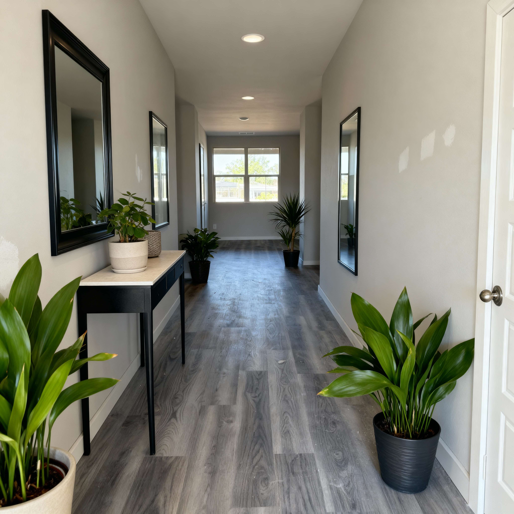
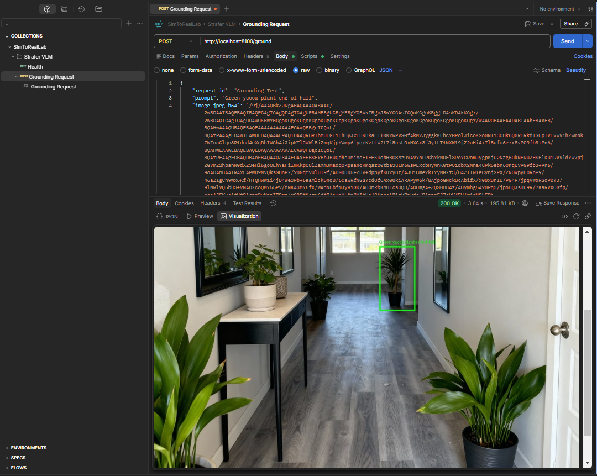

# Strafer Robot - Sim-to-Real

Sim-to-real development for the GoBilda Strafer mecanum robot.

This repository covers:

- Isaac Lab training on a Windows workstation
- Jetson ROS2 runtime for real-robot execution
- shared sim-to-real contracts in `strafer_shared`
- a workstation-hosted VLM grounding stack
- a workstation-hosted LLM planner with a Jetson-local executor

<p align="center">
  
  
</p>

## Project Direction

The current architecture is split into four layers:

1. `strafer_lab`
   - Isaac Lab environments, training, and evaluation
2. `strafer_shared`
   - shared physical constants, mecanum kinematics, and policy I/O contract
3. `strafer_ros`
   - Jetson-side robot runtime, sensing, navigation, TF, and safety-critical execution
4. `strafer_autonomy` and `strafer_vlm`
   - planner and VLM services hosted off-robot first, with the executor staying robot-local

The current working pipeline is:

```text
user command (CLI)
  -> LLM planner service (DGX Spark, port 8200)
  -> bounded MissionPlan
  -> Jetson executor
  -> VLM grounding when needed (DGX Spark, port 8100)
  -> robot-local goal projection and Nav2 navigation
  -> real hardware
```

## Current State

### Simulation

The Isaac Lab environment is in good shape:

- 18 environment variants across realism and sensor modes
- mecanum kinematics and shared constants aligned with the robot
- sensor and actuator noise models for sim-to-real transfer
- PPO training pipeline for navigation policies

<p align="center">
  <a href="docs/artifacts/strafer_isaac_lab_test_drive.mp4">
    
  </a>
  <br/>
  <em>Robot USD model in the Isaac Sim editor - <a href="docs/artifacts/strafer_isaac_lab_test_drive.mp4">watch video</a></em>
</p>

<p align="center">
  <a href="docs/artifacts/strafer_infinitygen_scene.mp4">
    
  </a>
  <br/>
  <em>Robot in a procedurally generated Infinigen apartment - <a href="docs/artifacts/strafer_infinitygen_scene.mp4">watch video</a></em>
</p>

### Robot Runtime

The robot-side ROS stack already has substantial coverage:

- `strafer_driver`
  - RoboClaw interface, wheel commands, odometry, joint states, watchdog
- `strafer_perception`
  - RealSense integration, depth downsampling, timestamp fixing, IMU filtering
- `strafer_description`
  - URDF and TF tree
- `strafer_slam`
  - RTAB-Map launch and tuning
- `strafer_navigation`
  - Nav2 launch and parameterization
- `strafer_bringup`
  - layered bringup launch files and validation helpers

### Autonomy and VLM

The full autonomy pipeline is operational end-to-end on real hardware:

- `strafer_autonomy`
  - Jetson-side executor with mission runner, skill dispatch, and HTTP clients
  - `strafer-executor` entry point reads `VLM_URL` / `PLANNER_URL` env vars and spins the command server
  - Operator CLI (`strafer-autonomy-cli submit/status/cancel`) for mission control
- `strafer_vlm`
  - VLM grounding service (Qwen2.5-VL-3B-Instruct) on DGX Spark port 8100
  - Scene description endpoint (`POST /describe`) for operator awareness
- LLM planner service (Qwen3-4B) on DGX Spark port 8200
  - Two-stage architecture: LLM classifies commands into intent types, deterministic compiler expands to validated `MissionPlan`

The Jetson executor calls both services over LAN HTTP. All mission state, cancel, retry,
and safety-critical behavior stays local on the robot.

Implemented skills: `scan_for_target` (rotate-and-ground loop), `locate_semantic_target`,
`project_detection_to_goal_pose`, `navigate_to_pose`, `describe_scene`, `wait`,
`report_status`, `cancel_mission`.

A Postman collection is included at `source/SImToRealLab.postman_collection.json` for
interactive testing of the DGX services.

<p align="center">
  
  
  <br/>
  <em>VLM grounding: "Green yucca plant end of hall" — Original scene (left) and Postman request showing output with bbox overlay (right)</em>
</p>

### Pipeline Snapshot

| Area | Status | Notes |
|---|---|---|
| CAD to USD | Done | Asset import, rigging, hierarchy cleanup |
| Isaac Lab environments | Done | Realism presets and sensor variants are in place |
| Shared kinematics and policy contract | Done | `strafer_shared` is the sim-to-real boundary |
| Jetson ROS driver and perception | Done | Driver, perception, URDF, SLAM, Nav2, goal projection |
| RL policy training | In progress | Navigation training is active in Isaac Lab |
| `strafer_inference` runtime | Planned | Policy runtime on the Jetson is still to be implemented |
| `strafer_autonomy` executor | Done | Mission runner, skill dispatch, CLI, HTTP clients, end-to-end on hardware |
| LLM planner service | Done | Qwen3-4B on DGX Spark:8200, two-stage intent→plan pipeline, 59 tests |
| VLM grounding service | Done | Qwen2.5-VL-3B on DGX Spark:8100, grounding + scene description, 124 tests |
| End-to-end autonomy | Done | "go to the tennis ball" tested on real hardware via full pipeline |

## Hardware

| Component | Model | Purpose |
|---|---|---|
| Workstation | DGX Spark (or Windows PC + NVIDIA GPU) | VLM grounding, planner hosting, Isaac Lab training |
| Robot compute | Jetson Orin Nano | ROS2 runtime and robot-local execution |
| Camera | Intel RealSense D555 | RGB, depth, IMU |
| Motors | 4x GoBilda 5203 Yellow Jacket (19.2:1) | Mecanum drive |
| Motor controllers | 2x RoboClaw ST 2x45A | USB serial motor and encoder interface |
| Chassis | GoBilda Strafer v4 | 4-wheel mecanum platform |

## Repository Structure

```text
source/
  strafer_lab/         Isaac Lab simulation and training
  strafer_shared/      shared constants, kinematics, policy I/O
  strafer_ros/         Jetson ROS2 packages
  strafer_autonomy/    autonomy schemas, executor, planner/VLM clients
  strafer_vlm/         workstation VLM grounding service, inference, training, and evaluation

docs/
  SIM_TO_REAL_PLAN.md
  SIM_TO_REAL_TUNING_GUIDE.md
  STRAFER_AUTONOMY_ROADMAP.md
  STRAFER_AUTONOMY_ROS.md
  STRAFER_AUTONOMY_INTERFACES.md
  STRAFER_AUTONOMY_COMMAND_INGRESS.md
  STRAFER_AUTONOMY_MVP_RUNTIME_DECISION.md
  STRAFER_AUTONOMY_SYSTEMS_OVERVIEW.md
  STRAFER_AUTONOMY_VLM_GROUNDING.md
  STRAFER_AUTONOMY_LLM_PLANNER.md
```

## Quick Start

### Simulation on Windows

```powershell
# Activate the Isaac Lab environment
& C:\Workspace\venv_isaac\Scripts\Activate.ps1

# Install local packages
python -m pip install -e source/strafer_lab
python -m pip install -e source/strafer_shared

# List Strafer environments
python -c "import strafer_lab; import gymnasium as gym; print([e for e in gym.envs.registry.keys() if 'Strafer' in e])"
```

#### Training

Run training from `C:\Workspace\Sim2RealLab\IsaacLab`:

```powershell
cd IsaacLab

# Recommended first run: NoCam
.\isaaclab.bat -p ..\Scripts\train_strafer_navigation.py --env Isaac-Strafer-Nav-Real-NoCam-v0 --num_envs 512

# Depth
.\isaaclab.bat -p ..\Scripts\train_strafer_navigation.py --env Isaac-Strafer-Nav-Real-Depth-v0 --num_envs 32

# Full RGB + depth
.\isaaclab.bat -p ..\Scripts\train_strafer_navigation.py --env Isaac-Strafer-Nav-Real-v0 --num_envs 32

# Headless
.\isaaclab.bat -p ..\Scripts\train_strafer_navigation.py --env Isaac-Strafer-Nav-Real-NoCam-v0 --num_envs 4096 --headless
```

#### Monitoring

```powershell
tensorboard --logdir logs\rsl_rl\strafer_navigation
```

#### Test or play

```powershell
cd IsaacLab
.\isaaclab.bat -p ..\source\strafer_lab\run_tests.py all
.\isaaclab.bat -p scripts\reinforcement_learning\rsl_rl\play.py --task Isaac-Strafer-Nav-Real-NoCam-Play-v0 --num_envs 50
```

### VLM Grounding on Windows

```powershell
# Install core + inference + live dependencies
python -m pip install -e "source/strafer_vlm[qwen,live,service]"
```

```powershell
# Launch the grounding service (downloads model on first run)
uvicorn strafer_vlm.service.app:create_app --factory --host 0.0.0.0 --port 8100
```

```powershell
# Single-image grounding smoke test (CLI, no service needed)
python -m strafer_vlm.test_qwen25vl_grounding `
  --image docs\artifacts\strafer_top.jpeg `
  --prompt "the robot chassis"
```

```powershell
# Live grounding against a local camera (CLI, no service needed)
python -m strafer_vlm.live_qwen25vl_grounding --source 0 --prompt "Locate: the robot chassis"
```

See `source/strafer_vlm/README.md` for env vars, API details, and curl/PowerShell examples.
Import `source/SImToRealLab.postman_collection.json` into Postman for interactive testing.

### Robot Runtime on Jetson

```bash
# Build all ROS2 packages
make build

# Install autonomy package
pip install -e source/strafer_autonomy
```

```bash
# Navigation stack only (driver + perception + SLAM + Nav2)
make launch

# Full autonomy stack (navigation + goal projection + executor → DGX services)
VLM_URL=http://192.168.50.196:8100 PLANNER_URL=http://192.168.50.196:8200 \
    make launch-autonomy
```

```bash
# Submit a mission
strafer-autonomy-cli submit "go to the tennis ball" --detach
strafer-autonomy-cli status
strafer-autonomy-cli cancel
```

```bash
# Verify SLAM, motion, and depth
python3 source/strafer_ros/ros_test_slam.py --drive forward --duration 3 --speed 1.0

# Verify perception stack
python3 source/strafer_ros/ros_test_perception.py --record
```

For the Jetson-side package inventory and architecture, see `docs/STRAFER_AUTONOMY_ROS.md`.

## Key Design Decisions

### Monorepo with shared contracts

Sim, ROS, autonomy, and VLM code stay in one repository so the core contracts do not drift.

### `strafer_shared` is the sim-to-real boundary

The real robot and Isaac Lab must agree on:

- physical constants
- mecanum kinematics
- policy observation and action contract

### Keep execution local

Safety-critical execution remains on the robot.

Planner and VLM services may move between workstation and cloud without changing the robot-side execution boundary.

### Keep the VLM narrow

`strafer_vlm` does semantic grounding only.

Depth projection, TF transforms, reachability, and motion execution remain robot-local.

### Planner and executor stay separate

The LLM planner is a text-to-plan service.

The Jetson executor owns mission state, validation, retries, cancel, and robot-facing control.

## Environments

| Realism | Sensors | Train ID | Obs dims |
|---|---|---|---|
| Ideal | Full (RGB + depth) | `Isaac-Strafer-Nav-v0` | 19215 |
| Ideal | Depth-only | `Isaac-Strafer-Nav-Depth-v0` | 4815 |
| Ideal | NoCam | `Isaac-Strafer-Nav-NoCam-v0` | 15 |
| Realistic | Full | `Isaac-Strafer-Nav-Real-v0` | 19215 |
| Realistic | Depth-only | `Isaac-Strafer-Nav-Real-Depth-v0` | 4815 |
| Realistic | NoCam | `Isaac-Strafer-Nav-Real-NoCam-v0` | 15 |
| Robust | Full | `Isaac-Strafer-Nav-Robust-v0` | 19215 |
| Robust | Depth-only | `Isaac-Strafer-Nav-Robust-Depth-v0` | 4815 |
| Robust | NoCam | `Isaac-Strafer-Nav-Robust-NoCam-v0` | 15 |

## Documentation

Core docs:

- [Sim-to-Real Plan](docs/SIM_TO_REAL_PLAN.md)
- [Sim-to-Real Tuning Guide](docs/SIM_TO_REAL_TUNING_GUIDE.md)
- [Strafer Autonomy Roadmap](docs/STRAFER_AUTONOMY_ROADMAP.md)
- [Strafer Autonomy ROS](docs/STRAFER_AUTONOMY_ROS.md)
- [Strafer Autonomy Interfaces](docs/STRAFER_AUTONOMY_INTERFACES.md)
- [Strafer Autonomy Command Ingress](docs/STRAFER_AUTONOMY_COMMAND_INGRESS.md)
- [Strafer Autonomy MVP Runtime Decision](docs/STRAFER_AUTONOMY_MVP_RUNTIME_DECISION.md)
- [Strafer Autonomy Systems Overview](docs/STRAFER_AUTONOMY_SYSTEMS_OVERVIEW.md)
- [Strafer Autonomy VLM Grounding](docs/STRAFER_AUTONOMY_VLM_GROUNDING.md)
- [Strafer Autonomy LLM Planner](docs/STRAFER_AUTONOMY_LLM_PLANNER.md)

Supporting docs:

- [Wiring Guide](docs/WIRING_GUIDE.md)
- [D555 IMU Kernel Fix](docs/D555_IMU_KERNEL_FIX.md)
- [Isaac Lab README](IsaacLab/README.md)

## References

- [GoBilda Strafer Chassis](https://www.gobilda.com/strafer-chassis-kit-v4/)
- [GoBilda 5203 Motor](https://www.gobilda.com/5203-series-yellow-jacket-planetary-gear-motor-19-2-1-ratio-24mm-length-8mm-rex-shaft-312-rpm-3-3-5v-encoder/)
- [RoboClaw ST 2x45A](https://www.gobilda.com/roboclaw-st-2x45a-motor-controller/)
- [Isaac Lab](https://isaac-sim.github.io/IsaacLab/)
- [ROS 2 Humble](https://docs.ros.org/en/humble/)

## License

MIT
