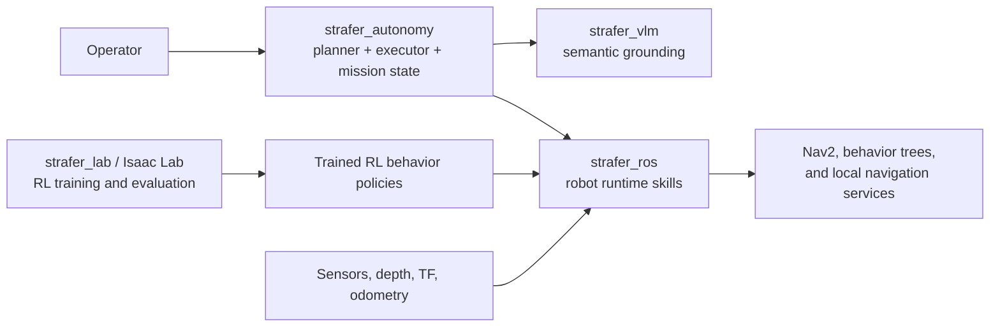
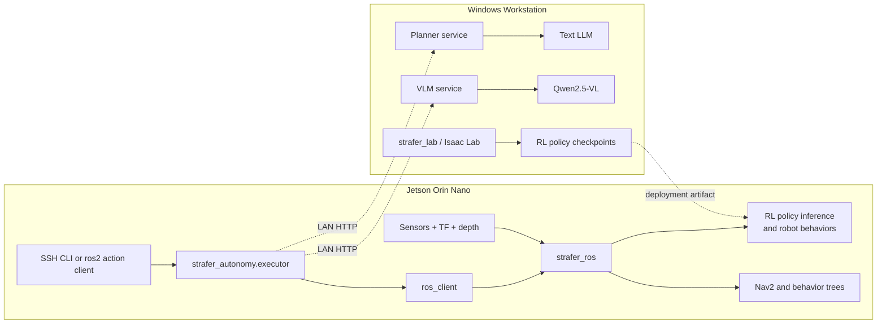
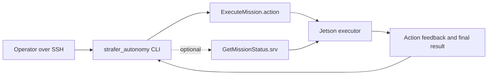
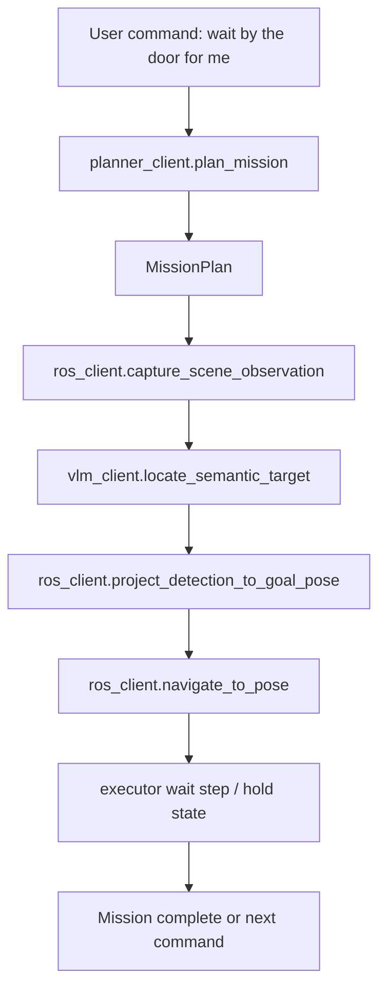
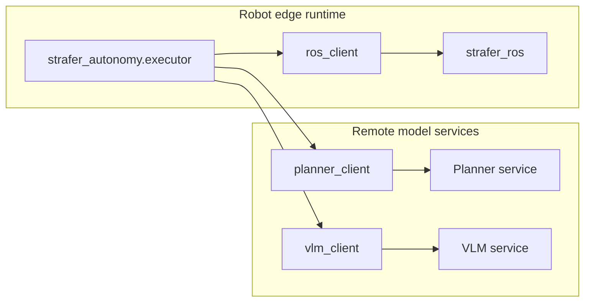
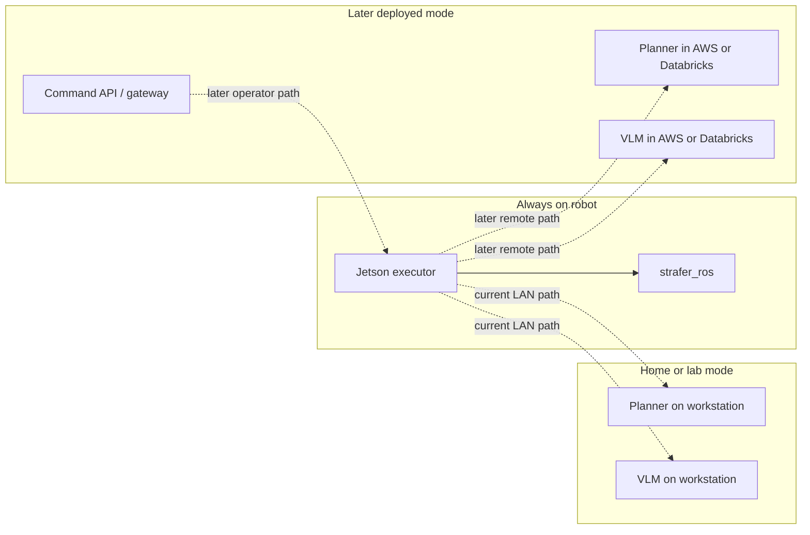

# Strafer Autonomy Systems Overview

This document is the high-level visual companion to the detailed autonomy docs.

It summarizes the main decisions already captured in:
- `STRAFER_AUTONOMY_COMMAND_INGRESS.md`
- `STRAFER_AUTONOMY_DEPLOYMENT_MODES.md`
- `STRAFER_AUTONOMY_INTERFACES.md`
- `STRAFER_AUTONOMY_LOCAL_DEVELOPMENT.md`
- `STRAFER_AUTONOMY_MVP_RUNTIME_DECISION.md`
- `STRAFER_AUTONOMY_ROADMAP.md`

## System Roles

## Chosen MVP Runtime

## MVP Command Ingress

## High-Level Mission Execution Flow

## Stable Interface Boundaries

## Deployment Evolution

## Architecture Summary

- `strafer_ros` stays robot-local and owns sensing, TF, projection, navigation, and safety-critical execution.
- `strafer_autonomy.executor` stays robot-local and owns mission state, retries, timeout, cancel, and skill sequencing.
- `strafer_lab` trains RL navigation and behavior policies that are later deployed onto the robot as inference artifacts.
- The robot execution layer is not just Nav2: it also includes trained RL behavior policies that sit alongside or underneath the classical navigation stack.
- Planner and VLM are heavy remote services from the executor's point of view.
- The first operator path is SSH plus CLI, but the long-term stable command boundary is robot-local `ExecuteMission.action`.
- Future workstation, web, mobile, or cloud frontends should adapt into the same robot-local executor contract rather than replacing it.
