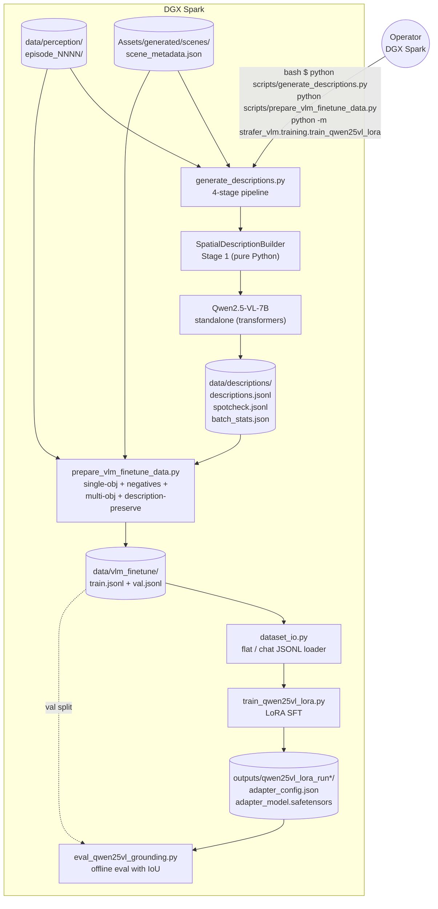
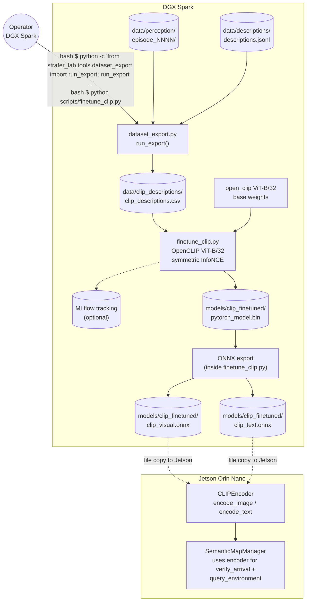
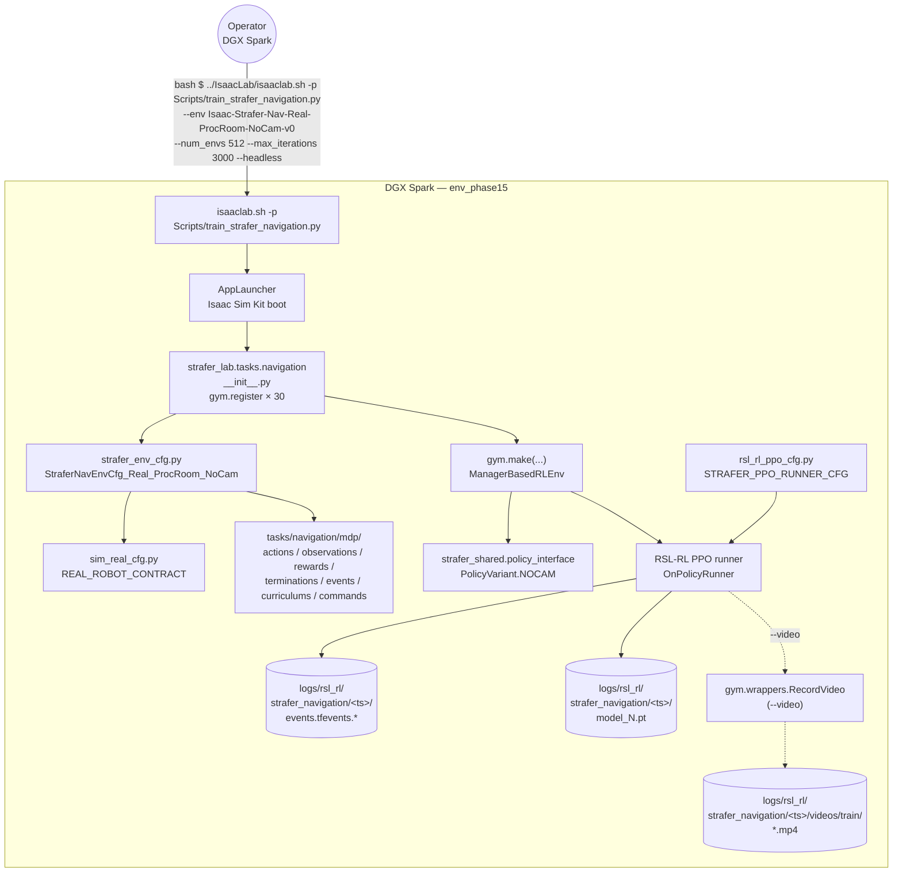
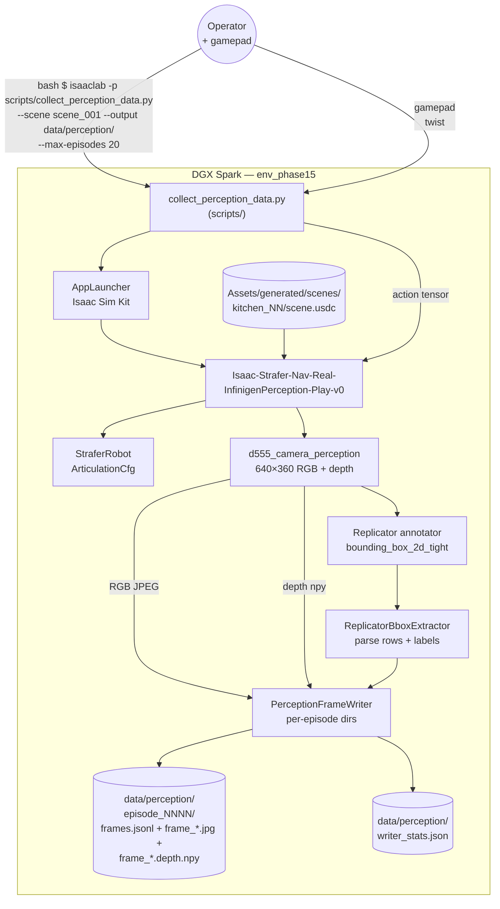
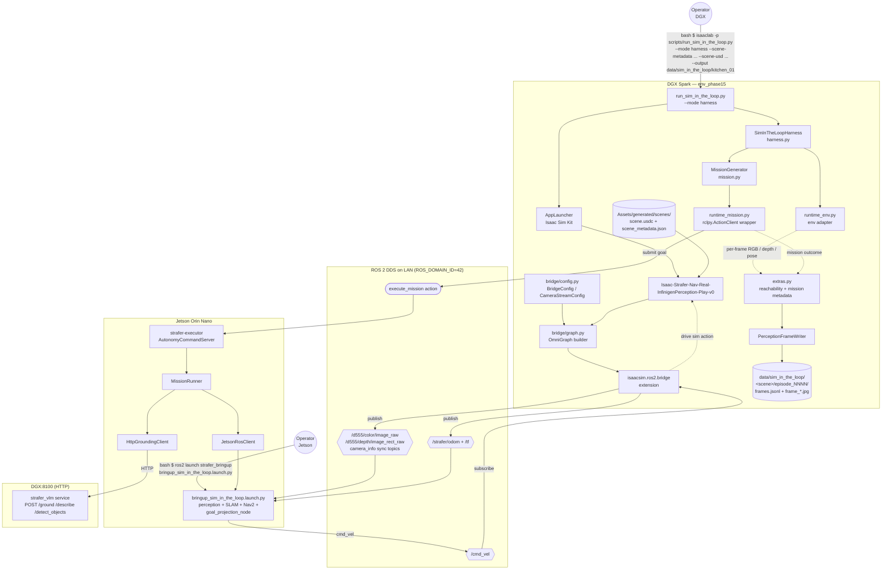
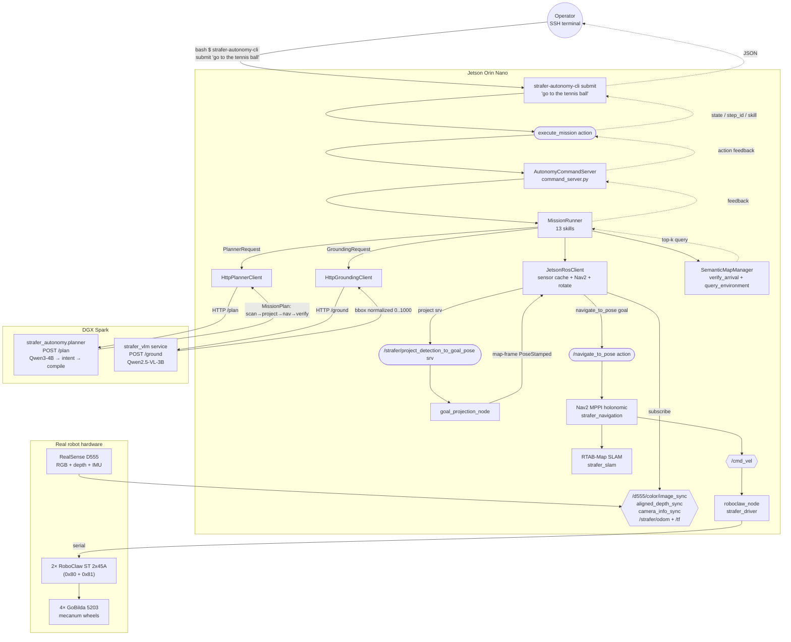
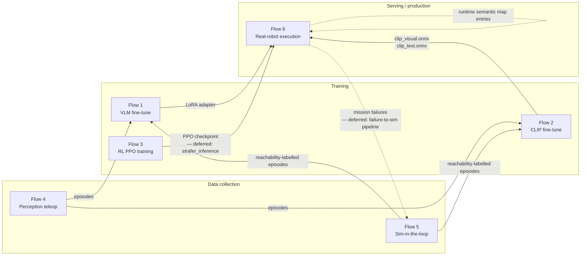

# Sim2RealLab system flow diagrams

Runtime reference for the six end-to-end information-flow paths that
make up the Sim2RealLab pipeline. Each diagram shows the operator
command that triggers the flow, every process / file / topic the data
passes through, cross-host boundaries, and the artifact the flow
produces. Nodes link into the source so GitHub renders them clickable.

This document describes **what the system does today**, not the design
rationale (see [`STRAFER_AUTONOMY_NEXT.md`](STRAFER_AUTONOMY_NEXT.md))
and not the test plan (a future `INTEGRATION_*.md` on the cycle).

## Index

- [Diagram legend](#diagram-legend)
- [Flow 1 — VLM data gathering and training](#flow-1--vlm-data-gathering-and-training)
- [Flow 2 — CLIP data gathering and training](#flow-2--clip-data-gathering-and-training)
- [Flow 3 — Strafer RL training (Isaac Lab)](#flow-3--strafer-rl-training-isaac-lab)
- [Flow 4 — Perception data gathering (teleop)](#flow-4--perception-data-gathering-teleop)
- [Flow 5 — Perception data gathering (sim-in-the-loop)](#flow-5--perception-data-gathering-sim-in-the-loop)
- [Flow 6 — End-to-end real-robot execution](#flow-6--end-to-end-real-robot-execution)
- [Cross-flow data dependency map](#cross-flow-data-dependency-map)

## Diagram legend

Consistent conventions across all six flows:

| Shape | Mermaid syntax | Meaning |
|---|---|---|
| Rectangle | `[Text]` | Process, service, script, node |
| Stadium | `([Text])` | ROS action / service call |
| Hexagon | <code>{{Text}}</code> | ROS topic |
| Rounded rect | `(Text)` | Data file / directory / JSON artifact |
| Cylinder | `[(Text)]` | Data store (ChromaDB, checkpoints directory) |
| Circle | `((Text))` | Human operator / external actor |
| Dashed border | `---` in style or `-.->` arrow | Optional branch / deferred path |

Host subgraphs are labelled `DGX Spark`, `Jetson Orin Nano`, `Real robot
hardware`. Arrows are labelled with transport (`ROS`, `HTTP`, `file`,
`subprocess`) when the medium matters.

Every node with a clear source-code home has a `click` link using a
relative path from this document (`../source/...`). GitHub renders those
as clickable when the Mermaid is viewed online.

---

## Flow 1 — VLM data gathering and training

**When**: batch pipeline, run manually after a teleop session has
produced enough episode frames (typically hundreds to thousands of
frames across several Infinigen scenes). Re-runs on demand when the
dataset grows or the description prompt changes.

**Triggered by**: operator on the DGX, inside `.venv_vlm` for the
batch-processing steps and `env_infinigen` (only if the 7B description
model is run in a separate env; default is `.venv_vlm`). Not automated
by CI.

**Produces**: a fine-tuned Qwen2.5-VL-3B-Instruct LoRA adapter in
`outputs/qwen25vl_lora_run*/`. **Consumes**: perception episodes from
Flow 4 or Flow 5, plus scene metadata produced by
`extract_scene_metadata.py`.

**Notes.** The 7B model loaded by `generate_descriptions.py` is
intentionally distinct from the 3B model that
[`strafer_vlm`](../source/strafer_vlm/README.md) serves on port 8100;
feeding the fine-tune target's own outputs back as training data causes
collapse. ProcRoom frames are excluded by `prepare_vlm_finetune_data.py`
(they do not transfer to real rooms). The adapter produced here is
loaded into the running VLM service by setting `GROUNDING_MODEL` to the
adapter-merged model path or wiring PEFT loading.

---

## Flow 2 — CLIP data gathering and training

**When**: batch pipeline, typically run once the description pipeline
has produced enough `(image, description)` pairs. Re-runs when the
semantic-map CLIP encoder needs to be re-trained (e.g., after a scene
distribution change).

**Triggered by**: operator on the DGX, inside `.venv_vlm`.

**Produces**: two ONNX files — `clip_visual.onnx` and `clip_text.onnx` —
loaded by the Jetson-side `CLIPEncoder` in
[`strafer_autonomy.semantic_map`](../source/strafer_autonomy/strafer_autonomy/semantic_map/clip_encoder.py)
at executor startup. Same upstream perception data as Flow 1, different
export format.

**Notes.** Both towers (visual + text) are trained jointly because the
Jetson uses `encode_image()` for place recognition AND `encode_text()`
for text queries. ProcRoom frames are excluded just like Flow 1. MLflow
tracking is optional — `finetune_clip.py` runs without it if
`--mlflow-experiment` is omitted.

---

## Flow 3 — Strafer RL training (Isaac Lab)

**When**: RL training runs, typically long-lived (hundreds to thousands
of PPO iterations). Manually triggered; not automated. Shorter
validation runs (10-100 iterations) are part of the install runbook in
[`VALIDATE_ISAAC_SIM_AND_INFINIGEN.md`](VALIDATE_ISAAC_SIM_AND_INFINIGEN.md).

**Triggered by**: operator on the DGX in `env_phase15`. The launcher
wrapper is Isaac Lab's `isaaclab.sh`.

**Produces**: PPO checkpoints under `logs/rsl_rl/strafer_navigation/<timestamp>/`.
Optional MP4 clips under `videos/train/` when `--video` is passed.

**Notes.** `train_strafer_navigation.py` (NOT Isaac Lab's stock
`train.py`) is the correct wrapper — the stock script does not import
`strafer_lab.tasks`, so the Strafer envs never get registered. The
`--video` branch records periodic MP4 clips at the configured interval;
the writer captures env-step frames via `gym.wrappers.RecordVideo`. Obs
dimensionality is 19 for `-NoCam-` envs, 4,819 for `-Depth-`, 19,219
for full RGB+Depth.

---

## Flow 4 — Perception data gathering (teleop)

**When**: manual teleop sessions, typically 10-50 episodes per Infinigen
scene before moving on. The operator drives through a procedurally
generated room with a gamepad while the env renders from the 640×360
perception camera and Replicator stamps semantic bboxes on every frame.

**Triggered by**: operator on the DGX in `env_phase15`, with a USB
gamepad connected. Isaac Sim runs at `num_envs=1` (the 640×360 render
caps throughput).

**Produces**: per-episode directories under `data/perception/episode_NNNN/`
containing `frames.jsonl` + `frame_NNNN.jpg` + optional
`frame_NNNN.depth.npy`. Layout exactly matches what
[`generate_descriptions.py`](../source/strafer_lab/scripts/generate_descriptions.py)
and
[`prepare_vlm_finetune_data.py`](../source/strafer_lab/scripts/prepare_vlm_finetune_data.py)
consume — no translation step.

**Notes.** `A` = keep episode, `B` = discard, `Start` = save & quit. The
env always advances; after keep/discard the script calls `env.reset()`
and starts the next episode. Replicator's `bounding_box_2d_tight`
annotator needs `semanticLabel` USD prim attributes to exist on scene
objects — those are written by
[`extract_scene_metadata.py`](../source/strafer_lab/scripts/extract_scene_metadata.py)
before any collection run.

---

## Flow 5 — Perception data gathering (sim-in-the-loop)

**When**: autonomous dataset-capture runs, driven by the real Jetson
autonomy stack against the simulated robot. Used to build
reachability-labelled datasets where ground truth (did the robot
actually reach the goal? did Nav2 decide it was unreachable?) is
available per frame.

**Triggered by**: operator on the DGX (harness) + operator on the
Jetson (bringup launch). Both sides must be up; the harness submits
missions via ROS action to the Jetson and captures frames as they are
executed.

**Produces**: `data/sim_in_the_loop/<scene>/episode_NNNN/frames.jsonl`
with mission / reachability / episode-outcome labels attached to each
frame's metadata. Consumed by the same description and SFT-prep
pipelines as Flow 4.

**Notes.** This is the most complex flow in the system: it spans both
hosts, has a feedback loop (`/cmd_vel` from the Jetson drives the sim,
whose sensors come back to the Jetson), and crosses both ROS and HTTP
boundaries. The Jetson autonomy stack runs unchanged — the Isaac Sim
ROS 2 bridge publishes on the same topic names the real robot's
hardware normally produces (`/d555/color/image_raw`, aligned depth,
`/strafer/odom`, TF). **IMU is not published** by the bridge (Isaac Sim
has no `ROS2PublishImu` node), so RTAB-Map runs visual-only in this
mode. Reachability labels come from monitoring Nav2's success/failure
result and any executor-side failure codes.

---

## Flow 6 — End-to-end real-robot execution

**When**: every real-robot mission submission — the "production" path
all other flows feed into. Continuously available when the robot and
DGX services are both up.

**Triggered by**: operator via `strafer-autonomy-cli` over SSH (or any
ROS action client on the Jetson's domain).

**Produces**: physical robot motion + mission action feedback + final
result JSON. Also updates the Jetson-local semantic map with any new
detections observed during the mission.

**Notes.** This is the flow all the upstream training and data
pipelines feed into. The planner runs on DGX port 8200, the VLM on DGX
port 8100, both reached via LAN HTTP. Every mission that ends in
`navigate_to_pose` appends a `verify_arrival` step — a CLIP top-k
ranking against the semantic map — so the executor can catch cases
where the robot "arrived" somewhere that does not look like the goal
area. The flow also powers the `/plan_with_grounding` optimization,
which lets the planner pre-ground the target via a co-located VLM call
and save one LAN image round-trip per mission.

---

## Cross-flow data dependency map

How the six flows feed each other. Solid arrows are hard dependencies
(downstream cannot run without upstream output); dashed arrows are soft
(the consumer augments or validates its own state).

**Notes.**

- Flow 4 and Flow 5 are interchangeable upstream sources for both
  training flows; the layout convention is identical. Flow 5 adds
  reachability + mission outcome metadata to each frame's JSONL record.
- Flow 3's checkpoint feeds Flow 6 through the deferred
  `strafer_inference` path. Until that ships, Flow 6 uses Nav2 as its
  only `navigate_to_pose` backend.
- The `Flow 6 → Flow 5` feedback edge is the deferred "failure-to-sim"
  pipeline (see [`DEFERRED_WORK.md`](DEFERRED_WORK.md)) — it closes the
  loop by turning real-world mission failures into targeted sim
  regression tests.
- Flow 6 feeding back into itself is the semantic map: every mission
  enriches the map (via detections + `detect_objects` calls), which
  later missions query through `verify_arrival` and `query_environment`.
